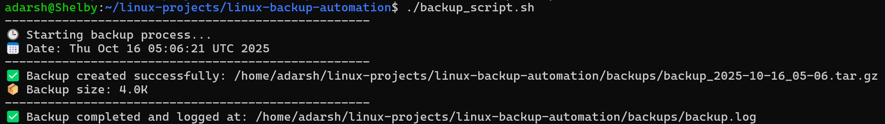
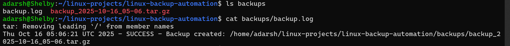

# 🖥️ Linux Backup Automation Script

### 👨‍💻 Author
**Adarsh Shivan**<br>GitHub: [https://github.com/adarshshivan](https://github.com/adarshshivan)

---

## 📘 Overview

The **Linux Backup Automation Script** is a Bash-based project designed to automatically back up important directories and maintain a record of every backup.
It compresses files into timestamped archives, saves them in a backup folder, and logs the status of each operation.
This script is ideal for developers, students, and Linux users who want a simple, efficient way to automate backups without external software.

---

## 🧰 Features
- Automatic timestamped backups
- Creates and organizes compressed archives (.tar.gz)
- Maintains a detailed log file of all backups
- Simple to customize and automate
- 100% Bash — no dependencies required

---

## ⚙️ Tools & Technologies Used
- 🐧 Linux / WSL (Ubuntu)
- 💻 Bash Scripting
- 📦 tar command (for compression)
- 🧮 date command (for timestamps)
- 🧾 Cron (for optional scheduling)
- ✍️ VS Code / Nano (for editing scripts)
- 🌐 GitHub (for version control)

---

## 🧩 How It Works

1. Defines your project source folder and backup destination.
2. Creates a new .tar.gz archive using the current date and time.
3. Stores the compressed backup inside a dedicated backups folder.
4. Logs each operation (success or failure) in backup.log.
5. Can be automated using a cron job for daily or weekly backups.

---

## ▶️ Usage Instructions

### 1️⃣ Make It Executable (Optional)
```bash
chmod +x backup_script.sh
```

### 2️⃣ Run the Script
```bash
bash backup_script.sh
```

or (if executable):

```bash
./backup_script.sh
```

---

### 📂 Example Output


### ▶️ Before Running
You have your project files in the main directory but no backups created yet.

### ▶️ After Running



### 🧾 Log File Example



---

### ⏰ Automate Daily Backups with Cron (Optional)

To automate your backups daily at 10 PM, open your crontab:
```bash
crontab -e
```

Add this line:
```bash
0 22 * * * /home/adarsh/linux-projects/linux-backup-automation/backup_script.sh
```

---

### 🎓 What I Learned

- Automating file compression and archiving with tar
- Creating time-based filenames using date
- Writing clean and reliable Bash scripts
- Logging with timestamps and error checks
- Scheduling tasks using cron
- Maintaining organized project structures

---

### 🧠 Project Summary

The Linux Backup Automation Script is a practical Bash automation project that simplifies data backup management.
It automatically compresses directories, names them with timestamps, and logs every operation.

This project demonstrates strong foundational knowledge in:

Linux automation and scripting

File and directory management

Log handling and process validation

Professional Bash documentation practices
